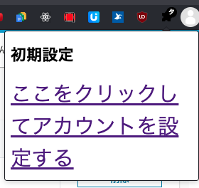

# 認証くん

LMSログイン時の二要素認証を、自動で入力してくれるChrome拡張機能

# 導入方法

## 拡張機能のインストール

node, npmをインストールし、

```
npm i
npm run build
```

extensionsフォルダをchrome://extensionsのLoad unpackedより読み込ませてください

## GASの認証

ブラウザ右上の拡張機能ボタン(なければ表示させる)を押して、「ここをクリックしてアカウントを設定する」を押下してください


## メールの設定

自分の使っているメーラーの設定で「GAS」の認証に使ったGoogleアカウントのGmailに、ynu.ac.jpにくる「YNU情報基盤センター：認証コード送信」が件名に入ったメールを転送するようにしてください。  
横国のOutlookはynu.jp内でしか転送できないので、ThunderbirdやMac標準のメーラーなどを使うといいと思います。

# 既知の問題

- [ ] 認証がはねられると、認証コードが通らない
- [ ] メールを確認する時間を12秒にしているが、環境によって認証コードのタイミングがずれる
